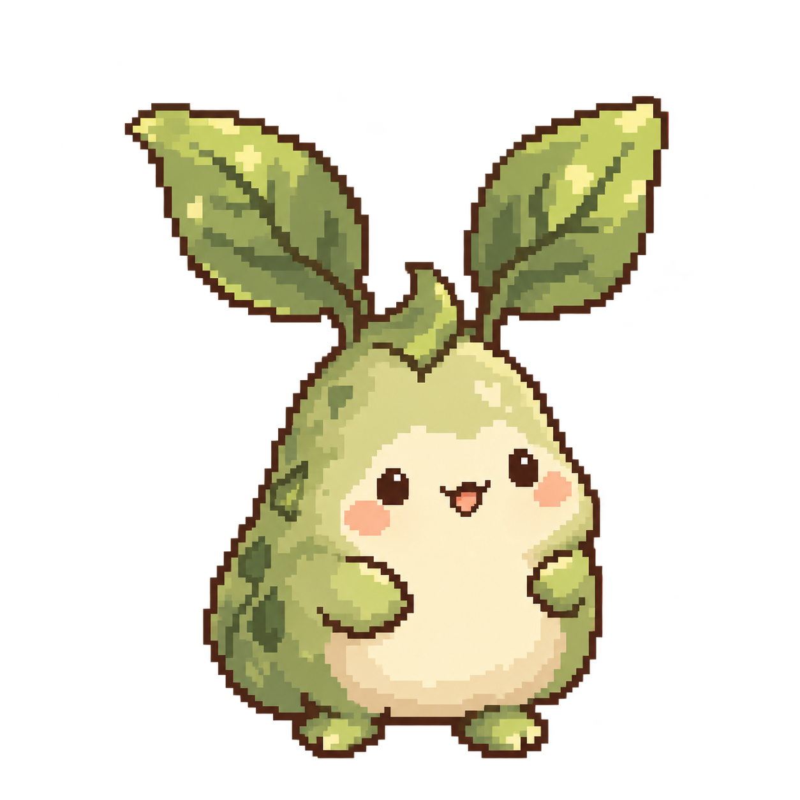
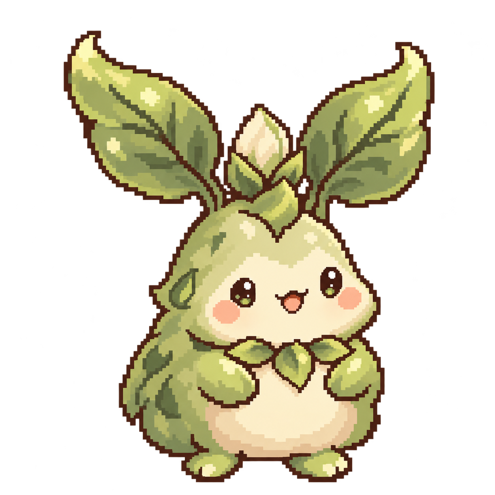
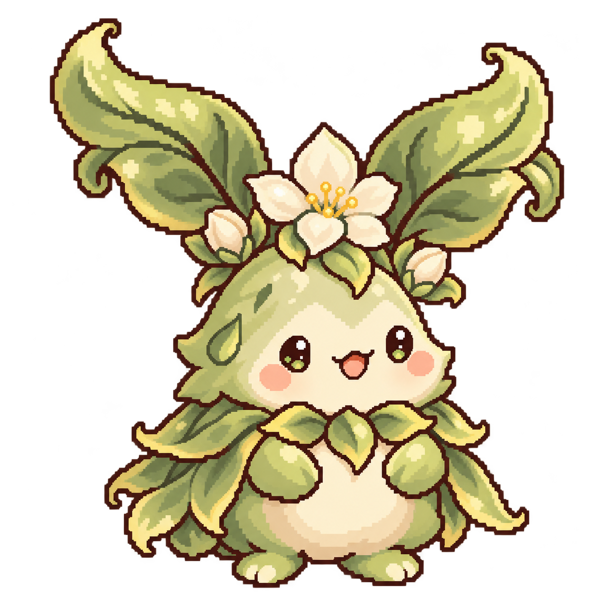
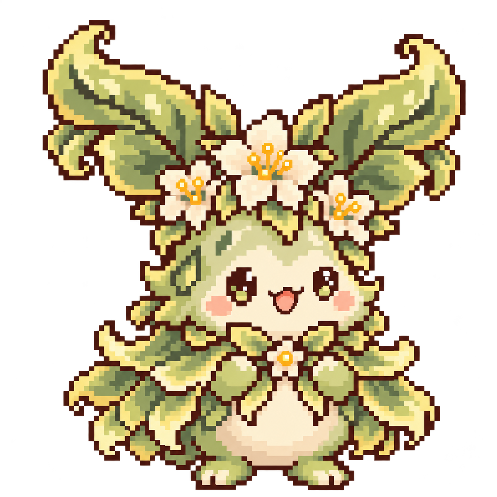
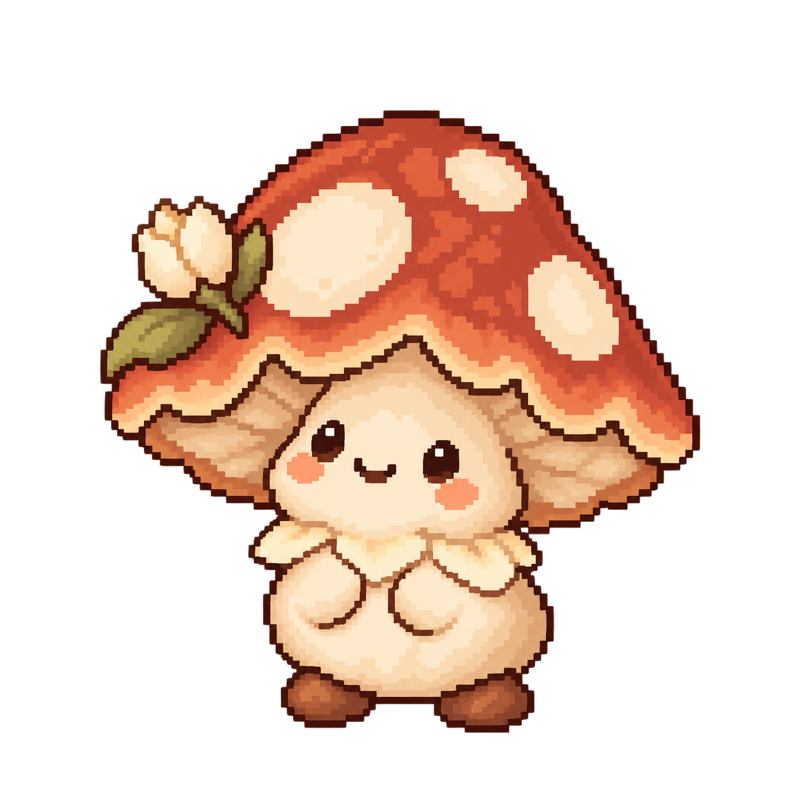
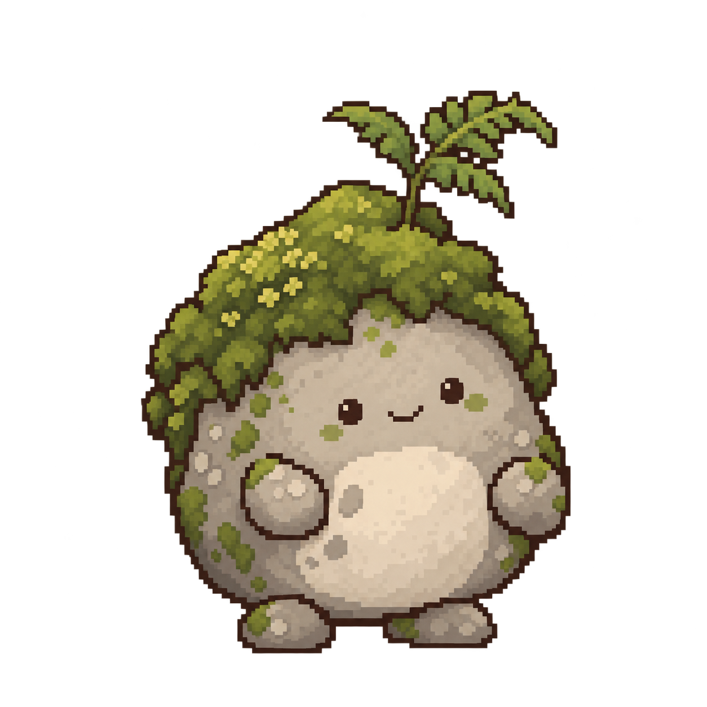
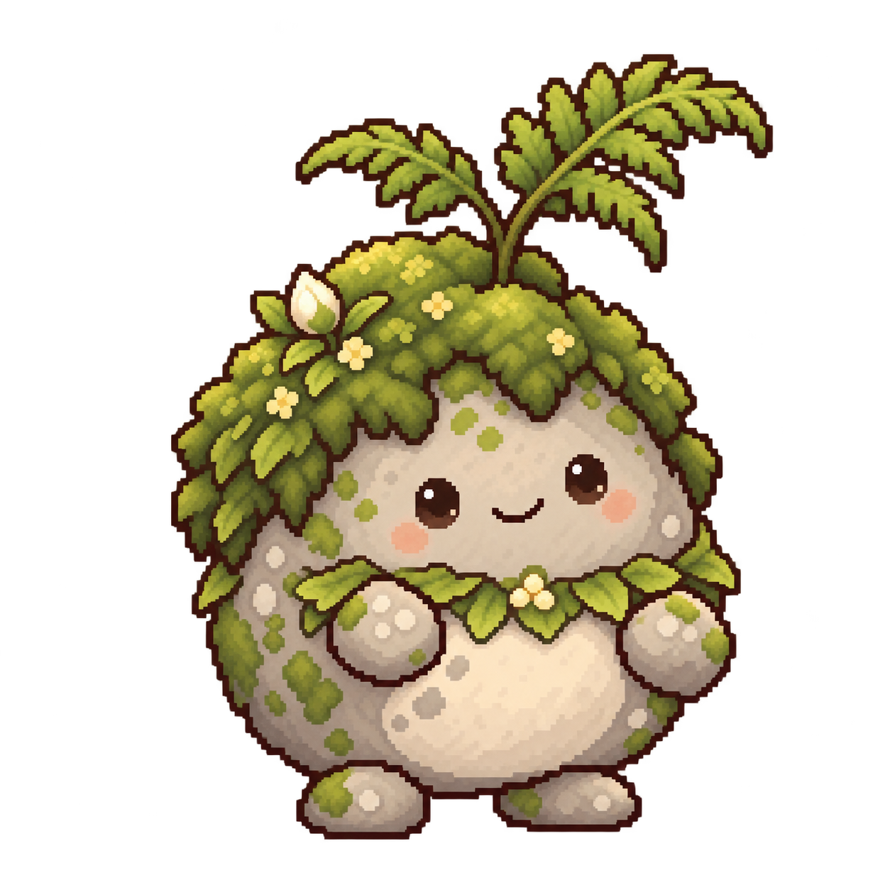
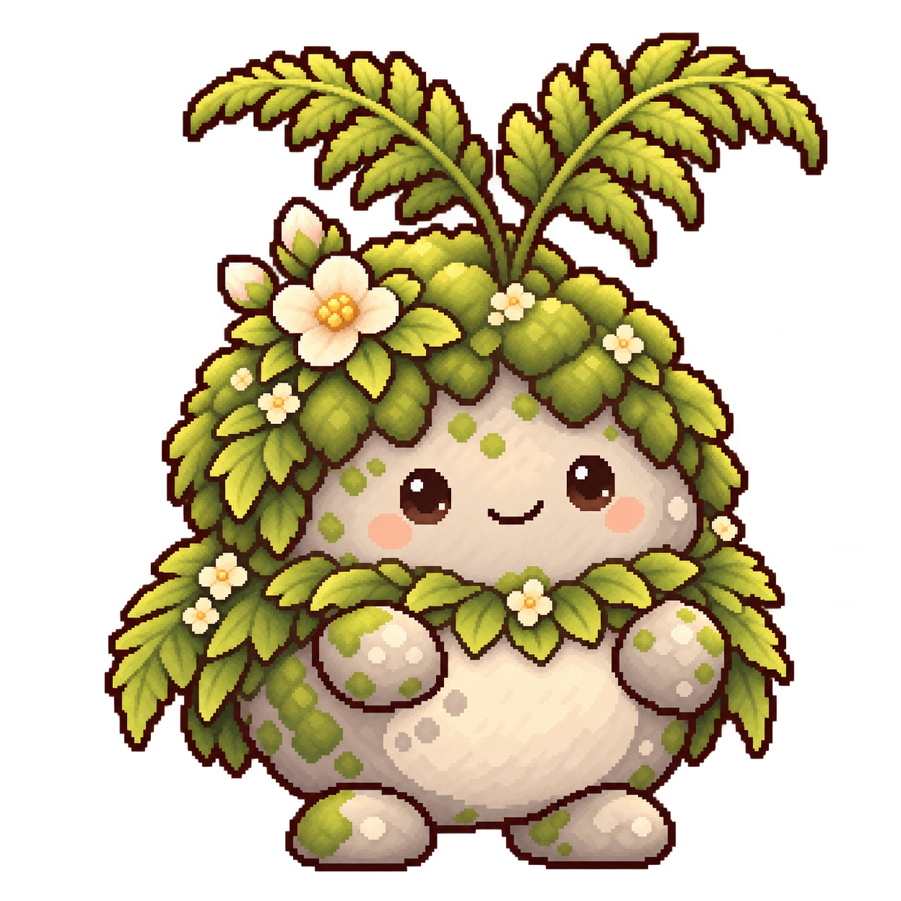
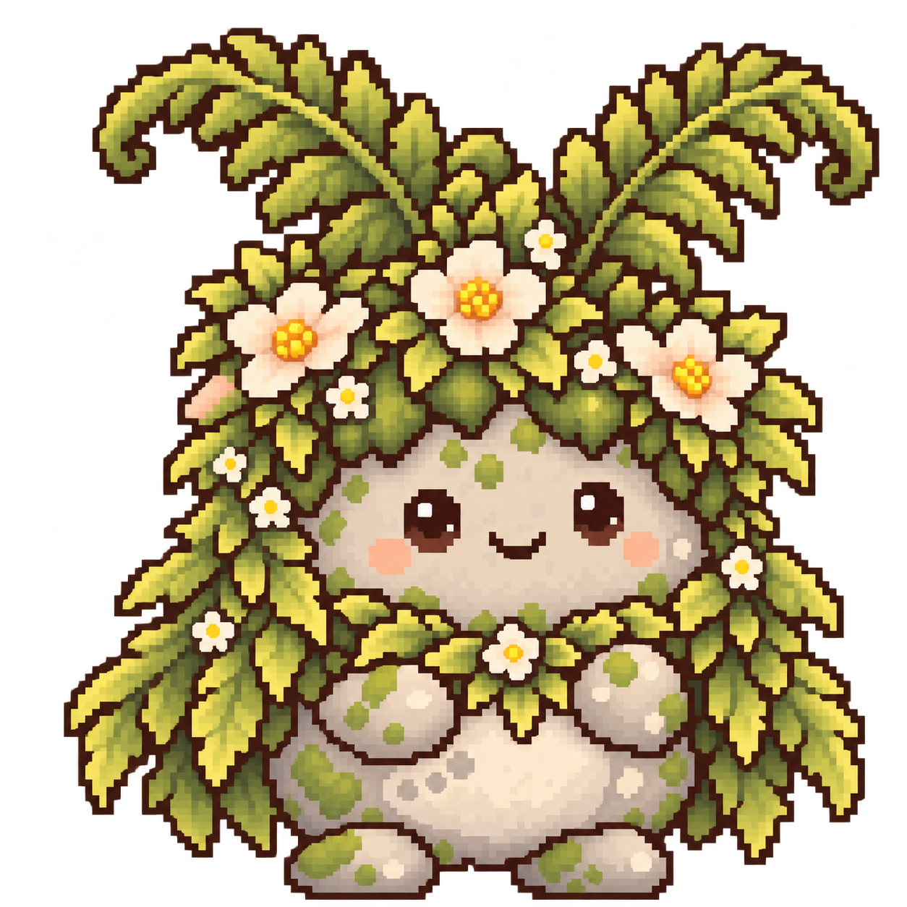

# 숲 정령 진화 디자인

ImageGen 내장 도구로 생성한 진화 콘셉트입니다. 새싹 정령, 버섯 요정, 이끼 돌 정령의 기존 모습에 각각 3번의 진화를 추가했습니다.
기본 모습 + 진화 1 + 진화 2 + 진화 3으로, 정령당 총 4개 모습입니다. 새로 생성한 PNG는 총 9장입니다.

원래의 둥근 몸과 작은 손발을 유지하면서, 꽃봉오리 → 개화 → 꽃 왕관과 풍성한 망토로 성장합니다. 모든 이미지는 투명 배경의 개별 캐릭터이며, 진화 3은 원본을 스타일 참조로 사용해 픽셀 질감을 추가로 다듬었습니다.

| 정령 | 기본 모습 | 진화 1 | 진화 2 | 진화 3 |
| --- | --- | --- | --- | --- |
| 새싹 정령 | [기본](../concepts/sprout-spirit.png) | [꽃봉오리 정령](sprout-spirit-evolution-1.png) | [꽃피는 정령](sprout-spirit-evolution-2.png) | [꽃 왕관 정령](sprout-spirit-evolution-3.png) |
| 버섯 요정 | [기본](../concepts/mushroom-sprite.png) | [꽃봉오리 버섯 요정](mushroom-sprite-evolution-1.png) | [꽃잎 망토 요정](mushroom-sprite-evolution-2.png) | [꽃 화관 요정](mushroom-sprite-evolution-3.png) |
| 이끼 돌 정령 | [기본](../concepts/moss-stone-spirit.png) | [고사리 돌 정령](moss-stone-spirit-evolution-1.png) | [꽃피는 이끼 정령](moss-stone-spirit-evolution-2.png) | [숲의 정원 정령](moss-stone-spirit-evolution-3.png) |

각 이미지의 전체 생성 프롬프트는 같은 이름의 `.prompt.md` 파일에 저장했습니다.

작업 브랜치: `tamagotchi`

## 미리보기

### 새싹 정령

| 기본 | 진화 1 | 진화 2 | 진화 3 |
| --- | --- | --- | --- |
|  |  |  |  |

### 버섯 요정

| 기본 | 진화 1 | 진화 2 | 진화 3 |
| --- | --- | --- | --- |
|  |  |  |  |

### 이끼 돌 정령

| 기본 | 진화 1 | 진화 2 | 진화 3 |
| --- | --- | --- | --- |
|  |  |  |  |

